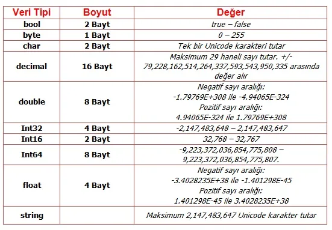

# Hafta 1
# İçindekiler
- [Java Için Kurulumlar](#java-için-kurulumlar)
- [Yazılım Nedir?](#yazılım-nedir)
- [Java Nedir?](#java-nedir)
  - [Java Nasıl Çalışır?](#java-nasıl-çalışır)
    - [Derleme Aşaması](#derleme-aşaması)
    - [Yürütme Aşaması](#yürütme-aşaması)
    - [Java'nın Platform Bağımsızlığı](#javanın-platform-bağımsızlığı)
    - [Java'nın Yüksek Verimliliği](#javanın-yüksek-verimliliği)
    - [Java'nın Çok İşlevliliği](#javanın-çok-i̇şlevliliği)
- [İlk Java programı](#i̇lk-java-programı)
- [Veri Tipleri](#veri-tipleri)
- [Değişkenler](#değişkenler)
  - [Değişkenleri Ekrana Yazma](#değişkenleri-ekrana-yazma)
  - [Değişken Tanımlama Kuralları](#değişken-tanımlama-kuralları)
- [Operatorler](#operatorler)
  - [Aritmetik Operatörler](#aritmetik-operatörler)
  - [Atama Operatörleri](#atama-operatörleri)
  - [İlişkisel Operatörler](#ilişkisel-operatörler)
  - [Karşılaştırma Operatörleri](#karşılaştırma-operatörleri)
  - [Diğer Operatörler](#diğer-operatörler)

## Java Için Kurulumlar
- Jdk indirme:https://www.oracle.com/tr/java/technologies/downloads (Windows için x64 MSI Installer tavsiye)
- Intellij Idea indirme: https://www.jetbrains.com/idea/download (30 gün ücretsiz/üyelik oluşturup öğrenci belgenizi gönderirseniz tamamen ücretsiz olucaktır)
## Yazılım Nedir?
Yazılım, bilgisayarların ve diğer elektronik cihazların çalışmasını sağlayan programların ve verilerin tümüdür. Yazılım, bilgisayar donanımının nasıl kullanılacağını ve belirli görevleri nasıl yerine getireceğini belirler.
## Java Nedir?
Java, Sun Microsystems tarafından geliştirilen ve 1995 yılında piyasaya sürülen bir programlama dilidir. Java, nesne yönelimli, platform bağımsız, yüksek verimli, çok işlevli, yüksek seviye, hem yorumlanan hem de derlenen bir dildir.
### Java Nasıl Çalışır?
Java, aşağıdaki iki aşamada çalışır:

- Derleme: Java kodları, javac derleyicisi tarafından derlenir. Derleme işlemi, Java kodlarını makine koduna dönüştürür.
- Yürütme: Derlenmiş Java kodu, Java sanal makinesi (JVM) tarafından çalıştırılır. JVM, platform bağımsız bir ortamdır. Bu, Java kodlarının herhangi bir platformda çalışabileceği anlamına gelir.

#### Derleme Aşaması
Java kodları, javac derleyicisi tarafından derlenir. Derleme işlemi, Java kodlarını makine koduna dönüştürür. Makine kodu, bilgisayarın doğrudan anlayabileceği bir koddur.

Derleme işlemi, aşağıdaki adımları içerir:
- Kaynak kod, sözdizimsel ve anlamsal analize tabi tutulur. Bu aşamada, kaynak koddaki hatalar tespit edilir ve düzeltilir.
- Kaynak kod, makine koduna dönüştürülür. Bu aşamada, Java kodundaki değişkenler, işlevler ve ifadeler makine koduna dönüştürülür.
- Derlenmiş kod, bir .class dosyası olarak kaydedilir. .class dosyası, Java sanal makinesi tarafından çalıştırılabilir.


#### Yürütme Aşaması
Derlenmiş Java kodu, Java sanal makinesi (JVM) tarafından çalıştırılır. JVM, platform bağımsız bir ortamdır. Bu, Java kodlarının herhangi bir platformda çalışabileceği anlamına gelir.

JVM, derlenmiş Java kodunu aşağıdaki adımları izleyerek çalıştırır:

- JVM, .class dosyasını yükler. Bu aşamada, JVM derlenmiş kodu belleğe yükler.
- JVM, derlenmiş kodu yorumlar. Bu aşamada, JVM derlenmiş kodu makine koduna dönüştürür ve ardından makine kodunu çalıştırır.
- JVM, derlenmiş kodun yürütülmesini tamamlar. Bu aşamada, JVM derlenmiş kodun yürütmesini tamamlar ve ardından kodun çıktısını üretir.


#### Java'nın Platform Bağımsızlığı
Java kodları, herhangi bir platformda çalışacak şekilde derlenebilir. Bu, Java kodlarının bir kez yazıldıktan sonra herhangi bir işletim sisteminde kullanılabileceği anlamına gelir.

Java'nın platform bağımsızlığı, aşağıdaki faktörlere bağlıdır:

- Java kodları, derleyici tarafından makine koduna dönüştürülür. Bu, Java kodlarının herhangi bir platformda çalışabileceği anlamına gelir.
- Java sanal makinesi (JVM), platform bağımsız bir ortamdır. Bu, JVM'nin herhangi bir platformda çalışabileceği anlamına gelir.

#### Java'nın Yüksek Verimliliği
Java, yüksek verimli bir programlama dilidir. Bu, Java programlarının genellikle diğer programlama dillerine göre daha hızlı ve verimli çalıştığı anlamına gelir.

Java'nın yüksek verimliliği, aşağıdaki faktörlere bağlıdır:

- Derleme: Java, derlenmiş bir dildir. Bu, Java kodunun Java Virtual Machine (JVM) tarafından çalıştırılmadan önce bir makine koduna dönüştürüldüğü anlamına gelir. Derleme, kodun daha hızlı yürütülmesine yardımcı olur.
- Otomatik çöp toplama: Java, otomatik çöp toplama özelliğine sahiptir. Bu, programcının bellek yönetimiyle ilgilenmesini ortadan kaldırır. Bellek yönetimi, performansı etkileyebilecek bir görevdir.
- Nesne yönelimli tasarım: Java, nesne yönelimli bir dildir. Nesne yönelimli tasarım, programları daha verimli hale getirmeye yardımcı olabilir.

#### Java'nın Çok İşlevliliği
Java, çok çeşitli uygulamalar geliştirmek için kullanılabilir. Mobil uygulamalar, web uygulamaları, oyunlar, masaüstü uygulamaları ve daha pek çok şey Java ile yazılabilir.

Java'nın çok işlevliliği, aşağıdaki faktörlere bağlıdır:

- Java, nesne yönelimli bir dildir. Bu, programların nesnelerden oluştuğu anlamına gelir. Nesneler, veri ve işlevlerden oluşan birimleri temsil eder. Bu, Java kodunun yeniden kullanılabilirliğini ve esnekliğini artırır.
- Java, platform bağımsızdır. Bu, Java kodunun herhangi bir platformda çalışabileceği anlamına gelir. Bu, Java kodunun farklı platformlar arasında taşınmasını kolaylaştırır.

## İlk Java programı

```java
public static void main(String[] args){
    System.out.println("Hello PAUGYT"); //System.out.println() içerisindekileri ekrana yazar
}
```
## Yorum Satırı
Yorum satırları java derleyicisi tarafından okunmayan/işlenmeyen yazılardır. Bu da yazdığımız kodların yanlarına/üstlerine 
o kod parçaları ile ilgili açıklamalar/bilgilendirmeler yazmamızı sağlar.
Java da sıklıkla kullandığımız 2 adet yorum satırı işareti vardır bunlar:
- //
- /* */
işaretleridir.
```java
  public static void main(String[] args){
    System.out.println("Hello PAUGYT");
    //Tek satırlık yorum satırı
    /*
      Çok satırlı 
      yorum satırı
    */
  }
  ```
## Veri Tipleri
Veri tipi, bir değişkenin tutabileceği verinin türünü tanımlar. Veri tipleri, sayısal, karakter, metin ve mantıksal olmak üzere dört ana kategoriye ayrılır.

- Sayısal veri tipleri, tamsayılar, ondalık sayıları temsil eder.
  - Tamsayı veri tipleri, tamsayı değerlerini temsil eder. Örneğin, int, long, short ve byte gibi veri tipleri tamsayı veri tipleridir.
  - Ondalık veri tipleri, ondalık sayı değerlerini temsil eder. Örneğin, float ve double gibi veri tipleri ondalık veri tipleridir.
- Karakter veri tipi, tek bir karakteri temsil eder. Örneğin, char gibi veri tipi karakter veri tipidir.
- Metin veri tipi, bir veya daha fazla karakterden oluşan bir metni temsil eder. Örneğin, String gibi veri tipi metin veri tipidir.
- Mantıksal veri tipi, doğru veya yanlış değerini temsil eder. Örneğin, boolean gibi veri tipi mantıksal veri tipidir.



## Değişkenler

Değişken, bir programda saklanan bir veriyi temsil eden bir isimdir. Değişkenler, veri tipine göre farklı değerler tutabilir.
```java
public static void main(String[] args){
    int x = 5; // Bir tamsayı değişkeni.
    String gyt = "Genc Yazilimcilar Toplulugu"; // Bir Metinsel değişken.
    char karakter = 'g'; // Bir karakter değişkeni.
    boolean yD = true; // Bir mantıksal veri türü değişkeni. true/false
    float kucukOndalikliSayi= 20.22 //Bir ondalıklı sayı değişkeni.  7 haneli hassasiyet sunar.
    double buyukOndalikliSayi= 20.222222222; 20.22; //Bir ondalıklı sayı değişkeni.  15 haneli hassasiyet sunar.
}
```
### Değişkenleri Ekrana Yazma
```java
public static void main(String[] args){
    int x = 5;
    String gyt = "Genc Yazilimcilar Toplulugu";
    char karakter = 'g'; 
    boolean yD = true;
    float kucukOndalikliSayi= 20.22
    double buyukOndalikliSayi= 20.222222222;
    System.out.println(x);
    System.out.println(gyt);
    System.out.println(yD);
    System.out.println(kucukOndalikliSayi);
    System.out.println(buyukOndalikliSayi);
}
```
### Değişken Tanımlama Kuralları
Java'da değişken tanımlarken belirli kurallara uymalısınız. İşte Java'da değişken tanımlama kuralları:
- Değişken Adı: Değişken adları harfle veya alt çizgi ( _ ) ile başlamalıdır.
Sadece ingilizce karakter **(alfabe)** kullanılmalıdır.
İlk karakter harf, alt çizgi ( _ ) olabilir veya özel karakterlerden $ 
kullanılabilir. Ardından harf, rakam veya alt çizgi ( _ ) kullanılabilir.
**Diğer karakterler de
  bazı yöntemler ile destekleniyor. Fakat ingilizce karakter dışındakiler önerilmez.**
Örnek geçerli değişken adları:
  - 'sayi'
  - '_yeniDegisken'
  - '$_myVariable'
  - 'musteriAdi123'
## Operatorler
### Aritmetik Operatörler

Java'da aritmetik operatörler, matematiksel işlemler yapmak için kullanılır.

Aritmetik operatörler, aşağıdakileri gerçekleştirmek için kullanılır:
- Toplama: (+)
- Çıkarma: (-)
- Çarpma: (*)
- Bölme: (/)
- Modül: (%)

```java
public static void main(String[] args){
    int a = 10;
    int b = 20;

    int toplam = a + b;
    System.out.println("Toplam :" + toplam);
    int fark = b - a;
    System.out.println("Fark :" + fark);
    int carpim = a * b;
    System.out.println("Çarpım :" + carpim);
    int bolum = b / a;
    System.out.println("Bolüm :" + bolum);
    int mod = b % a;
    System.out.println("Kalan :" + mod);
}
```
### Atama Operatörleri
Bir değişkeni başka bir değişkene atamak veya bir değişkene bir veri atamak için kullanılır.
Atama operatörleri aşağıdaki gibidir:
- Eşittir: (=)
- Artı Eşittir (+=)
- Eksi Eşittir (-=)
- Çarpı Eşittir (*=)
- Bölü Eşittir (/=)
```java
public static void main(String[] args){
    // Ve operatörü
    int a = 10;
    int b = 20;
    a+=5; // a=a+5; ile aynıdır. Sonuç: 15
    a-=b; // a=a-b; ile aynıdır. Sonuç: -5
    a*=b; // a=a*b; ile aynıdır. Sonuç: -100
    a/=b; // a=a/b; ile aynıdır. Sonuç: -5
}
```
### Mantıksal Operatörler

Java'da mantıksal operatörler, iki veya daha fazla mantıksal ifadenin değerini karşılaştırmak için kullanılır.

Mantıksal operatörler, aşağıdakileri gerçekleştirmek için kullanılır:
- Ve: (&&)
- Veya: (||)
- Değil: (!)


```java
public static void main(String[] args){
    // Ve operatörü
    int a = 10;
    int b = 20;
    boolean esitMi = (a == b);
    System.out.println(esitMi); // false
    // Veya operatörü
    int a = 10;
    int b = 20;
    boolean esitMi = (a == b);
    boolean buyukMu = (a > 10);
    boolean veya = esitMi || buyukMu;
    System.out.println(veya); // true
    // Değil operatörü
    int a = 10;
    boolean esitMi = (a == 10);
    boolean degil = !esitMi;
    System.out.println(değil); // false
}
```

### İlişkisel Operatörleri
Java'da karşılaştırma operatörleri, iki değeri karşılaştırmak için kullanılır. 

Bu operatörler
- Eşittir (==) 
- Eşit değildir (!=)
- Büyüktür (>)
- Küçüktür (<)
- Büyük Eşittir (>=)
- Küçük eşittir (<=)

```java
public static void main(String[] args){
    // Eşittir operatörü
    int a = 10;
    int b = 10;
    boolean esitMi = (a == b);
    System.out.println(esitMi); // true
    // Eşit değildir operatörü
    int a = 10;
    int b = 20;
    boolean esitMi = (a != b);
    System.out.println(esitMi); // true
    // Büyüktür operatörü
    int a = 10;
    int b = 20;
    boolean buyukMu = (a > b);
    System.out.println(buyukMu); // false
    // Küçüktür operatörü
    int a = 10;
    int b = 20;
    boolean kucukMu = (a < b);
    System.out.println(kucukMu); // true
    // Büyük eşittir operatörü
    int a = 10;
    int b = 20;
    boolean buyukEsittir = (a >= b);
    System.out.println(buyukEsittir); // false
    // Küçük eşittir operatörü
    int a = 10;
    int b = 20;
    boolean kucukEsittir = (a <= b);
    System.out.println(kucukEsittir); // true
}
```


### Diğer Operatörler
Java'da aritmetik ve mantıksal operatörlerin yanı sıra, aşağıdaki gibi diğer operatörler de bulunur:

- Bitsel operatörler: Sayıların bitlerini manipüle etmek için kullanılır.
- Koşul operatörleri: Koşulları kontrol etmek için kullanılır.
- Yazdırma operatörleri: Ekran çıktısı üretmek için kullanılır.
- Diğer operatörler: Java dilinde kullanılan diğer operatörler.
