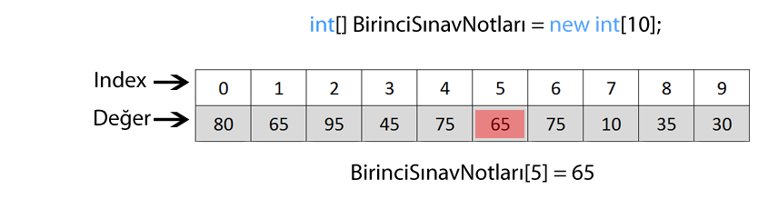
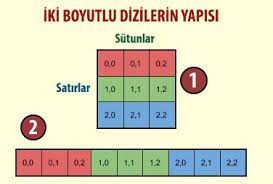

# Hafta 2
# İçindekiler
- [Array](#array)
- [Nesne Yönelimli Programlama (OOP)](#nesneyönelimli-programlama-oop)
  -[Nesne(Object) Nedir?](#nesne-object-nedir) 
# Array
Diziler/Array, Java'da aynı türden verileri içeren veri yapılarıdır.
Bu sayede aynı türde olan birden fazla veriyi tek bir değişken
üzerinde tutabiliyoruz. Diziler sabit boyutludur, yani 
başlangıçta belirlediğiniz boyutta oluşturulur ve daha sonra 
boyutları değiştirilemez.

**Bir dizinin örnek tanımı:**
```java
veri_tipi[] degisken_name=new veri_tipi[eleman_sayisi];
```
şeklinde tanımlanır.
Burdaki tanımdan da anlaşılıcağı üzere şimdiye kadar tanımladığımız
Java programlarının başlangıç noktası olan main fonksiyonumuzda
aslında args ismine sahip bir String array parametresine sahiptir.


```java
public static void main(String[] args){
    int[] birinciSinavNotlari=new int[10]; // 10 elaman saklayabilen bir int dizisi
    birinciSinavNotlari[0]=80; // dizinin ilk elemanı
    birinciSinavNotlari[1]=65; //dizinin ikinci elemanı
    //Bu şekilde tek tek verebiliriz yada
    int[] sinavNotlari={80,65,95,45,75,65,75,10,35,30}; // Şeklinde tek seferdede tanımlayabiliriz
}
```
Dizinin elemanlarına ulaşmak için:
```java
public static void main(String[] args){
    int[] sinavNotlari={80,65,95,45,75,65,75,10,35,30};
    System.out.println("1. Eleman: "+sinavNotlari[0]); // gibi tek tek uğraşabiliriz
    for(byte i=0;i<dizi.length;i++){
        System.out.println(i+". Eleman: "+sinavNotlari[i]);
    }
    //şeklinde döngü ile yazdırabiliriz
}
```
burada sadece ekrana yazdırmak olarak düşünmeyelim. Burda veriyi
manipüle edebiliriz. Mesela 3 üncü elemandaki değeri bir fonksiyona
gönderebiliriz vb.

Burada son olarak veriye erişmek için foreach dediğimiz daha kolay
bir yöntem var. Foreach in yapısı:
```java
for(degisken_tipi degisken_ismi:Veri_dizisi){
...
}
```
```java
public static void main(String[] args){
    byte[] sinavNotlari={80,65,95,45,75,65,75,10,35,30};
    for(byte eleman:sinavNotlari){
        System.out.println(eleman);
    }
}
```
## Matrisler
Java'da matrisler, çok boyutlu diziler (arrays) olarak tanımlanır.
İki veya daha fazla boyutlu diziler kullanılarak matrisler 
oluşturulabilir.



```java
public static void main(String[] args){
    byte[] matris=new byte[2][2];//2x2 lik bir matris
    matris[0][0] = 1;
    matris[0][1] = 2;
    matris[1][0] = 3;
    matris[1][1] = 4;
    for(byte i=0;i<2;i++){
        for(byte k=0;k<2;k++){
            System.out.print(matris[i][k]+" ");
        }
        System.out.println();
    }
}
```
Bu kodun çıktısı:
```
1 2
3 4
```
# Nesne Yönelimli Programlama (OOP)
Nesne Yönelimli Programlama (Object Oriented Programming), 
sınıflar ve nesneler kavramına dayanan bir programlama 
yaklaşımıdır. Bu yaklaşımın amacı, ihtiyaç duyulan programı 
daha küçük parçalara bölerek, yönetilebilir ve yeniden 
kullanılabilir hale getirmektir. Her küçük parçanın kendine 
ait özelliği, verileri ve diğer küçük parçalarla nasıl iletişim 
kuracağı bilgileri bulunur.

OOP’de programlar, nesnelerin birbirileriyle etkileşime 
geçmeleri sağlanmasıyla tasarlanır. Bizler gerçek hayattaki 
karmaşıklığı bir şekilde modelleyerek bunu bilgisayarın anlamasını 
sağlamaktayız. Modelleme, insanın problem çözmek üzere eskiden 
beri kullandığı bir yöntemdir. Büyükçe bir problemin tamamını 
zihinde canlandırıp çözmeye çalışmak yerine, oluşturulacak model
ya da modeller üzerinde hedef sistemin görünüşü, davranışı ya da
bazı durumlarda verdiği tepkiler gözlemlenebilir.

Nesne Yönelimli Programlama ile bizler yapacağımız her şeyi 
bilgisayarın anlayacağı şekilde modelleyip, “nesne” halinde 
aktarıyoruz. Böylelikle gerçek hayatta bizim için geçerli olan 
nesneleri artık bilgisayarların anlayacağı hale getirmiş 
oluyoruz. Tabi ki kullanılan programlama dilinin bizlere 
verdiği imkanlar dahilinde. Böylelikle kodlayan kişi ile 
bilgisayar arasında dilden bağımsız bir anlaşma, bir felsefe 
ortaya çıkmış oluyor. Artık bizim için “araba” nesnesi ne 
anlama geliyorsa, bilgisayar için de aynı anlama geliyor.

Neden Nesne Yönelimli Programlama (OOP)?
- OOP, hızlı ve uygulaması kolay bir yaklaşımdır.
- OOP, programlar için net bir yapı sağlar.
- OOP, "Don't Repeat Yourself" yani "Kendini Tekrar Etme" 
ilkesini uygular ve kodun bakımını, düzenlenmesini ve hata 
ayıklamasını kolaylaştırır.
- OOP, daha az kod ve daha kısa geliştirme süresiyle, yeniden 
kullanılabilir uygulamalar oluşturmayı mümkün kılar.
- OOP, yapıya daha sonradan yeni özellikler ekleyerek genişletilebilirlik sağlar.
- OOP, problemleri gerçek hayattaki işlemlere göre modeller.
## Nesne(Object) Nedir?
