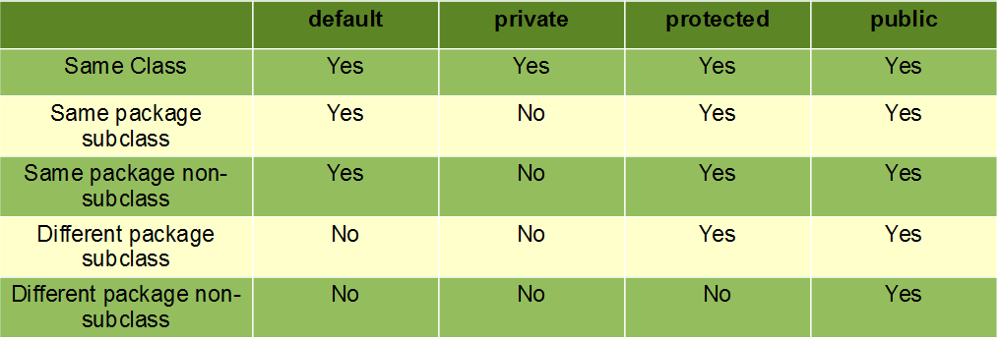

# Hafta 3
# İçindekiler
- [Array](#array)
- [Nesne Yönelimli Programlama (OOP)](#nesneyönelimli-programlama-oop)
  - [Nesne (Object) Nedir?](#nesne-object-nedir)
  - [Sınıf (Class) Nedir?](#sınıf-class-nedir)
  - [Odev](#odev)
  - [Constructor Nedir?](#Constructor-nedir)
  - [This Nedir?](#this-nedir)
  - [Modifiers Nedir?](#modifiers-nedir)
    - [Access Modifiers](#access-modifiers)
  - [Encapsulation](#encapsulation)
    - [Odev 2](#odev-2)
    - [Odev 2 Cozum](#odev-2-cozum)
# Array
Diziler/Array, Java'da aynı türden verileri içeren veri yapılarıdır.
Bu sayede aynı türde olan birden fazla veriyi tek bir değişken
üzerinde tutabiliyoruz. Diziler sabit boyutludur, yani 
başlangıçta belirlediğiniz boyutta oluşturulur ve daha sonra 
boyutları değiştirilemez.

**Bir dizinin örnek tanımı:**
```java
veri_tipi[] degisken_name=new veri_tipi[eleman_sayisi];
```
şeklinde tanımlanır.
Burdaki tanımdan da anlaşılıcağı üzere şimdiye kadar tanımladığımız
Java programlarının başlangıç noktası olan main fonksiyonumuzda
aslında args ismine sahip bir String array parametresine sahiptir.


```java
public static void main(String[] args){
    int[] birinciSinavNotlari=new int[10]; // 10 elaman saklayabilen bir int dizisi
    birinciSinavNotlari[0]=80; // dizinin ilk elemanı
    birinciSinavNotlari[1]=65; //dizinin ikinci elemanı
    //Bu şekilde tek tek verebiliriz yada
    int[] sinavNotlari={80,65,95,45,75,65,75,10,35,30}; // Şeklinde tek seferdede tanımlayabiliriz
}
```
Dizinin elemanlarına ulaşmak için:
```java
public static void main(String[] args){
    int[] sinavNotlari={80,65,95,45,75,65,75,10,35,30};
    System.out.println("1. Eleman: "+sinavNotlari[0]); // gibi tek tek uğraşabiliriz
    for(byte i=0;i<dizi.length;i++){
        System.out.println(i+". Eleman: "+sinavNotlari[i]);
    }
    //şeklinde döngü ile yazdırabiliriz
}
```
burada sadece ekrana yazdırmak olarak düşünmeyelim. Burda veriyi
manipüle edebiliriz. Mesela 3 üncü elemandaki değeri bir fonksiyona
gönderebiliriz vb.

Burada son olarak veriye erişmek için foreach dediğimiz daha kolay
bir yöntem var. Foreach in yapısı:
```java
for(degisken_tipi degisken_ismi:Veri_dizisi){
...
}
```
```java
public static void main(String[] args){
    byte[] sinavNotlari={80,65,95,45,75,65,75,10,35,30};
    for(byte eleman:sinavNotlari){
        System.out.println(eleman);
    }
}
```
## Matrisler
Java'da matrisler, çok boyutlu diziler (arrays) olarak tanımlanır.
İki veya daha fazla boyutlu diziler kullanılarak matrisler 
oluşturulabilir.


```java
public static void main(String[] args){
    byte[] matris=new byte[2][2];//2x2 lik bir matris
    matris[0][0] = 1;
    matris[0][1] = 2;
    matris[1][0] = 3;
    matris[1][1] = 4;
    for(byte i=0;i<2;i++){
        for(byte k=0;k<2;k++){
            System.out.print(matris[i][k]+" ");
        }
        System.out.println();
    }
}
```
Bu kodun çıktısı:
```
1 2
3 4
```
# Nesne Yönelimli Programlama (OOP)
Nesne Yönelimli Programlama (Object Oriented Programming), 
sınıflar ve nesneler kavramına dayanan bir programlama 
yaklaşımıdır. Bu yaklaşımın amacı, ihtiyaç duyulan programı 
daha küçük parçalara bölerek, yönetilebilir ve yeniden 
kullanılabilir hale getirmektir. Her küçük parçanın kendine 
ait özelliği, verileri ve diğer küçük parçalarla nasıl iletişim 
kuracağı bilgileri bulunur.

OOP’de programlar, nesnelerin birbirileriyle etkileşime 
geçmeleri sağlanmasıyla tasarlanır. Bizler gerçek hayattaki 
karmaşıklığı bir şekilde modelleyerek bunu bilgisayarın anlamasını 
sağlamaktayız. Modelleme, insanın problem çözmek üzere eskiden 
beri kullandığı bir yöntemdir. Büyükçe bir problemin tamamını 
zihinde canlandırıp çözmeye çalışmak yerine, oluşturulacak model
ya da modeller üzerinde hedef sistemin görünüşü, davranışı ya da
bazı durumlarda verdiği tepkiler gözlemlenebilir.

Nesne Yönelimli Programlama ile bizler yapacağımız her şeyi 
bilgisayarın anlayacağı şekilde modelleyip, “nesne” halinde 
aktarıyoruz. Böylelikle gerçek hayatta bizim için geçerli olan 
nesneleri artık bilgisayarların anlayacağı hale getirmiş 
oluyoruz. Tabi ki kullanılan programlama dilinin bizlere 
verdiği imkanlar dahilinde. Böylelikle kodlayan kişi ile 
bilgisayar arasında dilden bağımsız bir anlaşma, bir felsefe 
ortaya çıkmış oluyor. Artık bizim için “araba” nesnesi ne 
anlama geliyorsa, bilgisayar için de aynı anlama geliyor.

Neden Nesne Yönelimli Programlama (OOP)?
- OOP, hızlı ve uygulaması kolay bir yaklaşımdır.
- OOP, programlar için net bir yapı sağlar.
- OOP, "Don't Repeat Yourself" yani "Kendini Tekrar Etme" 
ilkesini uygular ve kodun bakımını, düzenlenmesini ve hata 
ayıklamasını kolaylaştırır.
- OOP, daha az kod ve daha kısa geliştirme süresiyle, yeniden 
kullanılabilir uygulamalar oluşturmayı mümkün kılar.
- OOP, yapıya daha sonradan yeni özellikler ekleyerek genişletilebilirlik sağlar.
- OOP, problemleri gerçek hayattaki işlemlere göre modeller.
## Nesne (Object) Nedir?
Nesne, gerçek hayattaki varlıkları ve kavramları 
temsil etmek için kullanılan temel bir kavramdır. 
Her nesnenin kendine özgü nitelikleri (özellikleri) 
ve davranışları (eylemleri) vardır. Bu, nesnelerin 
kendilerine ait kimliklerini ve özelliklerini taşıdığı
anlamına gelir.

**Nitelik (Özellik):** Bir nesnenin özellikleri, o 
nesnenin mevcut durumunu tanımlar. Örneğin, bir 
"Araba" nesnesinin rengi, markası, modeli, hızı ve 
yakıt tüketimi gibi nitelikleri olabilir. Her araba 
farklı bir renkte olabilir ve farklı bir markaya sahip 
olabilir. Bu nitelikler, arabalar arasındaki farkları 
tanımlar.

**Davranış (Eylem):** Bir nesnenin davranışları, o 
nesnenin yapabileceği eylemleri temsil eder. Örneğin, 
bir "Köpek" nesnesinin havlamak, koşmak, yemek yemek 
gibi davranışları olabilir. Her tür köpek, bu davranışları 
farklı şekillerde sergileyebilir.

Nesneler aynı zamanda isimlendirilmiş varlıklardır. 
İsimleri, programlarımızda bu nesnelere erişmek ve 
onlarla etkileşimde bulunmak için kullanılır. Örneğin, 
"myCar" adlı bir nesne, bir arabanın temsilini yapabilir
ve bu nesne üzerinden arabayla ilgili işlemler 
gerçekleştirilebilir.

Nesneler, OOP'nin temel taşlarıdır ve programlarımızı 
gerçek dünyadaki varlıkları ve olayları modellemek 
için kullanırız. Bu sayede karmaşıklığı basitleştirir, 
kodun daha anlaşılır ve yönetilebilir olmasını sağlarız.

## Sınıf (Class) Nedir ?
OOP sınıflar ve nesneler üzerine kurulmuştur, "Sınıflar" bir 
problemi soyutlamak ve genelleştirmek için kullanılan yapılardır
veya kılavuzlardır. Sınıflar, bir nesneye ait tüm özellikleri 
temsil eder. Bu özellikler nesnenin ne tür nitelikleri ve 
davranışları olacağını belirler.

Mesela "Araba" bir sınıftır. Arabalara ait nitelikler renk, 
hız, vites sayısı, yakıt türü vb. bir sürü nitelik olabilir. 
Park sensörü, oto pilot, hız sabitleme gibi arabaların kendilerine
özel davranışları da olabilir. Bir araba üretilirken, bir 
yapım kılavuzuna ihtiyaç vardır. Programlama da bu kılavuzlara 
"Sınıf (Class)" denir.


Hadi birlikte ilk class'ımızı oluşturalım.
```java
public class Car{
    public String carName;
    public void printName(){
        System.out.println(carName);
    }
}
```
Bu class tan bir nesne oluşturup onu kullanmak için:
```java
Car bmw=new Car();
bmw.carName="BMW";
bmw.printName();
```
### Odev
İçerisinde aracın:
- name (String)
- model (String)
- productionYear (short)
- price (double)
- discount (float)

değişkenlerine sahip,
- calculateAge(), Aracın yaşını hesaplayıp geriye döner 
- calculatePrice(), Aracın indirimli fiyatını hesaplayıp geriye döner

fonskiyonlarına sahip bir **Car** sınıfı tanımlayınız.
### Constructor Nedir?
Constructor bir class new'lendiğinde ilk çalışan yapıdır. Bu
sayede sınıfımızın özelliklerini sonradan girmek yerine bu yapı
ile verebiliriz.

Constructor tanımı, class'ın içerisinde class ile aynı isimde olan 
bir fonksiyondur. Normal bir fonksiyonda ki gibi contructer da 
parametreli veya parametresiz olabilir. Yukarıdaki Car örneğimiz
için bir Constructor tanımlayalım ve carName i Constructor ile atayalım:
```java
public class Car{
    public String carName;
    public Car(String name){
        carName=name;
    }
}
```
**Kullanım:**
```java
Car bmw=new Car("bmw");
```
Burda da gördüğünüz üzere Constructor yapısının normal bir fonksiyon
tanımı ve kullanımından pek bir farkı yoktur.
### This Nedir?
This keyword, bulunduğu sınıfı temsil eden bir keyword'dür. Bu
keyword sayesinde sınıfımızdaki herhangi bir fonksiyondaki parametre
olarak ifade ettiğimiz değişken ismi ile sınıftaki değişken ismini
ayırmamıza yarar.
```java
public class Car{
    public String carName;
    public Car(String carName){
        this.carName=carName;
        //this.carName sınıfımızdaki değişken
        //carName fonksiyonumuzun değişkeni
    }
}
```
**Not: Bir değişken sadece tanımlandığı süslü parantezler({}) içerisinde yaşar.**
### Modifiers Nedir?
Javada modifiers: sınıflar, değişkenler, metotlar ve diğer Java 
bileşenlerinin erişim düzeyini, görünürlüğünü ve davranışını belirlemek
için kullanılan özel anahtar kelimelerdir. 
#### Access Modifiers
Erişilebilirlik özellikleri için.

| Modifier  | Description                                                                                                                 |
|-----------|-----------------------------------------------------------------------------------------------------------------------------|
| public    | Herhangi bir sınıf veya paketten erişilebilir.                                                                              |
| private   | Koda sadece tanımlandığı sınıftan erişebilir.                                                                               |
| protected | Koda sadece aynı paketten veya alt sınıftan erişilebilir. Alt sınıf kavramını Inheritance konusunda daha detaylı göreceğiz. |
| default | Koda sadece aynı classtan veya aynı paketten erişilebilir.                                                                  |


Default modifierini erişim belirteci hiç vermediğimiz zamanlar
otamatik olarak kullanırız.
```java
class Car{
  ...
}
```
Yukarıdaki şekilde class tanımı yapar isek, bu class a sadece aynı paket içerisinden 
erişebiliriz.
```
byte a=5;
```
Yukarıdaki değişkeni bir sınıf içerisinde bu şekilde tanımlar isek, bu class'ı new'ledikten
sonra bu değişkene sadece aynı class,aynı package ten erişilebilir.
Örnek:
```java
public class Car{
    private String carName;
    public Car(String carName){
        this.carName=carName;
    }
}
```
```java
Car bmw=new Car("BMW");
String carName=car.carName; // Burada java bize carName e ulaşamadığını söyleyecektir.
```
Yukarıdaki örnekte carName değişkenini **private** olarak tanımladığımız 
için **Main class'ımızda** java car.carName ifadesi ile carName e ulaşmamızı engelleyecektir.

### Encapsulation
Encapsulation, nesne yönelimli programlamanın temel prensiplerinden 
biridir ve verilerin gizlenmesini ve sınıfın iç yapısının dış 
dünyaya karşı korunmasını sağlar. Java'da encapsulation, sınıf 
içinde veri alanlarının özel (private) olarak işaretlenmesi ve 
bu verilere erişmek için get ve set metotlarının kullanılmasıyla 
gerçekleştirilir. Encapsulation'ın temel amacı, veriye doğrudan 
erişim yerine sınıfın iç yapısının kontrolünü sağlayarak sınıfın 
daha güvenli ve sürdürülebilir olmasını sağlamaktır.

Basitce encapsulation uygulaması:
```java
public class Car{
  private String carName;
  public String getCarName(){
    return carName;
  }
  public void setCarName(String carName){
    this.carName=carName;
  }
}
```
Eğerki car sınıfının değişkenine değer atamak yada ulaşmak istersek artık bu fonksiyonlar
aracılığı ile bunu yapacağız.
```java
Car bmw=new Car();
bmw.setCarName("BMW");
System.out.println(bmw.getCarName());
```
#### Odev 2
Car class'ımızı ele alıcak olursak;
- name ve model değişkenlerine içi boş bir string verilmemeli
- productionYear değişkenine 1886 dan düşük, 2023 den büyük bir değer verilmemeli
- price alanı 0 dan küçük değer almamalı 
- indirim oranıda 0-100 aralığında olmalı

Eğerki encapsulation yapmaz isek bir kullanıcı car sınıfımızdaki 
bu değişkenlere yukarıdaki gibi istemediğimiz değerler verebilir.
Ödev olarak verdiğimiz car class ını yukarıdaki kurallar ışığında düzenleyelim.

#### Odev 2 Cozum
```java
public class Car{
    private String carName;
    private String model;
    private short productionYear;
    private double price;
    private float discount;

    public String getCarName() {
      return carName;
    }
  
    public void setCarName(String carName) {
      if(carName != null && !carName.isEmpty()){
        this.carName=carName;
      }
    }
  
    public String getModel() {
      return model;
    }
  
    public void setModel(String model) {
      if(model!=null && !model.isEmpty()){
        this.model = model;
      }
    }
  
    public short getProductionYear() {
      return productionYear;
    }
  
    public void setProductionYear(short productionYear) {
      if(productionYear>1886 && productionYear<=2023){
        this.productionYear = productionYear;
      }
    }
  
    public double getPrice() {
      return price;
    }
  
    public void setPrice(double price) {
      if(price>0){
        this.price = price;
      }
    }
  
    public float getDiscount() {
      return discount;
    }
  
    public void setDiscount(float discount) {
      if(discount>0 && discount <=100){
        this.discount = discount;
      }
    }
}
```
```java
Car bmw=new Car();
bmw.setCarName("BMW");
System.out.println(bmw.getCarName());
```