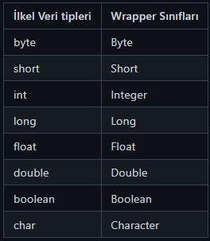

# Hafta 5
# İçindekiler
# Soyutlama (Abstraction)
Nesne yönelimli programlamada Soyutlama (Abstraction) ilkesi, eğer bir sınıf için nesne üretmek 
mantıksız geliyorsa o sınıf soyutlanabilir.Alt sınıfların ortak özelliklerini ve işlevlerini 
taşıyan ancak henüz bir nesnesi olmayan bir üst sınıf oluşturmak istenirse bir soyut (abstract) 
üst sınıf oluşturulur.

Soyutlama, bir sınıfa veya metoda temel görevlerin tanımlanması, detayların ise tanımlanmaması 
demektir. Temel olarak bir soruna ait çözüme giderken kullanılacak yöntemlerin, ilk etapta daha 
genel basit ve soyut bir tanımını yapmaktır.

## Abstract Anahtar Kelimesi ve Soyut Sınıf Kavramı (Abstract Class)

Soyutlama kavramı, sınıfın içindeki iç işleyişi dışarıdan izole etmek, yani gizlemektir. 
Örneğin: bilgisayarı kullanırken çoğu kullanıcı bilgisayarın iç işleyişinden haberi olmaz. 
Hafızanın işlemciyle haberleşmesi, işlemler arası senkronizasyon, klavyeden girilen değerlerin 
ekrana yansıması gibi birçok işlemin detayı kullanıcılardan gizlenmiş durumdadır. Kullanıcılar 
sadece bu fonksiyonları veya işlevleri bir arayüz vasıtasıyla çağırıp kullanmaktadır. İç 
detaylarına müdahale etmemektedir.

Aynı şekilde Java'da sınıflarımızı tasarlarken, bazı fonksiyonların ve işlevlerin sadece sınıf 
içinde kalması, dış dünyada bu sınıftan nesneleri kullanan kişilerin bu iç fonksiyonları 
bilmesine gerek yoktur. Örneğin, KDV tutarını hesaplayan fonksiyonun sınıf içinde kullandığı 
birçok başka fonksiyon olabilir. Bu fonksiyonların sınıf dışına açılmasının bir anlamı yoktur. 
Sadece miktarı verip o miktara göre KDV tutarını hesaplayacak bir dış fonksiyon yeterlidir. 
Yazılım dünyasında bu nedenle soyutlama kavramı yazılım tasarımında önemli bir kavramdır. 
Soyutlama yapabilmek için "abstract" anahtar kelimesi, "interface" gibi yapılar bizlere yardımcı 
olmaktadır.

**Soyutlama için Java'da iki yöntem mevcuttur:**
- Interface tanımlamak
- Abstract sınıf tanımlamak

## Soyut Sinif (Abstract Class)
Abstract anahtar kelimesi ile tanımlanan sınıflardır. Sınıfın içinde soyut ("abstract") 
metotlar veya normal fonksiyonlar tanımlanabilir. Soyut sınıflardan "new" anahtar kelimesi 
ile bir nesne oluşturulamaz.

### Soyut Sınıf Özellikleri:
- abstract anahtar kelimesi ile tanımlanmış olması gerekiyor.
- Soyut veya soyut olmayan fonksiyonlar tanımlanabilir.
- Soyut sınıflardan "new" anahtar kelimesi ile nesne oluşturulamaz.
- Kurucu metodu ve static fonksiyonlar tanımlanabilir.
- "final" kelimesi ile tanımlanmış fonksiyonları içerebilir. Bu final fonksiyonlar alt 
sınıflarda ezilemezler (override).
```java
// Soyut sınıf örneği
public abstract class Doping {
    protected double price;
    protected double[] taxes;
    
    public double[] getTaxes() {
        return taxes;
    }
    
    public void setTaxes(double[] taxes) {
        this.taxes = taxes;
    }
    
    public double getPrice() {
        return price;
    }
    
    public void setPrice(double price) {
        this.price = price;
    }
    
    // Soyut metot örneği
    public abstract double calculate();
}

```
Yukarıda soyut bir sınıf tanımladık. "abstract" anahtar kelimesi ile sınıfı tanımladık, 
ayrıca sınıfın içinde "calculate" isimli "abstract" metodu tanımladık. Aynı zamanda soyut 
olmayan metotlar da tanımladık. Senaryomuzda bir e-ticaret sisteminde "Doping" tipinde ek 
ürünler olduğunu düşünelim. İlan tarihini güncelleyen bir doping çeşidimiz olsun ve bir de 
üst sırada çıkmanızı sağlayan bir doping olsun. Bu iki alt sınıfta "Doping" isimli sınıftan 
kalıtım alarak belli özellikleri kendilerine alsınlar. Ancak, her dopingin ücret hesaplama 
yöntemi birbirinden farklı olabilir. Ayrıca, her dopingin mutlaka fiyat hesaplama fonksiyonu 
olmalıdır.

Yukarıdaki durumda "abstract" sınıf tanımlayıp diğer doping çeşitleri bu ATA sınıftan kalıtım 
alacaklardır. "calculate" isimli "abstract" metodu, "metodu ezme" (overriding) yöntemiyle ezip, 
metodu kendi ihtiyaçlarına göre dolduracaklardır. Alt sınıflardaki diğer özellikler soyutlama 
tekniğiyle dış dünyadan gizlenecektir. Dış dünyadan dopingi kullanmak isteyen başka bir sınıf 
veya kod parçası doping nesnesi üzerindeki "calculate" fonksiyonunu çağırıp fiyatı 
hesaplayacaktır. Diğer iç hesaplama ve çalışma detaylarına müdahale etmeyecektir.

```java
public class TopOfListDoping extends Doping {
    public TopOfListDoping(double price) {
        super.setPrice(price);
    }
    
    // "Doping" soyut sınıfından kalıtım yoluyla gelen, "calculate" isimli soyut metodu, metot ezme (overriding) yöntemiyle alt sınıf kendi ihtiyacına göre dolduruyor.
    // "TopOfList" isimli doping türünde vergiler olmadığı için komisyon oranı eklenip ücret hesaplanıyor. Fakat, diğer doping türlerinde hesaplama farklı olabilir.
    @Override
    public double calculate() {
        return super.getPrice() + super.getPrice() * 0.35;
    }
}

public class UptodateDoping extends Doping {
    public UptodateDoping(double price, double[] taxes) {
        super.setPrice(price);
        super.setTaxes(taxes);
    }

    // "Doping" soyut sınıfından kalıtım yoluyla gelen, "calculate" isimli soyut metodu, metot ezme (overriding) yöntemiyle alt sınıf kendi ihtiyacına göre dolduruyor.
    // "UptodateDoping" isimli doping türünde vergiler fiyata dahil olduğu için komisyon oranı eklenip ve vergiler hesaplanıp ücret belirleniyor. Görüldüğü gibi her doping türünün fiyat hesaplama yöntemleri birbirinden farklıdır. Soyutlama ile sınıflara ait iç çalışma detayları gizlenmiş olur. Doping türlerinde sadece "calculate" isimli fonksiyon dış dünyaya açıktır. Diğer tüm fonksiyonlar ve özellikler sınıf içinde kalmıştır.
    @Override
    public double calculate() {
        return calculateTaxes() + commisionRate();
    }

    private double calculateTaxes() {
        double totalTaxValue = 0;
        for (int i = 0; i < super.getTaxes().length; i++) {
            totalTaxValue += super.getTaxes()[i];
        }
        return totalTaxValue;
    }

    private double commisionRate() {
        return super.getPrice() * 0.2;
    }
}
```
**"Doping"** soyut sınıfından kalıtım yoluyla gelen **"calculate"** isimli soyut metodu metot 
ezme yöntemiyle alt sınıf kendi ihtiyacına göre dolduruyor. **"UptodateDoping"** isimli 
doping türünde vergiler fiyata dahil olduğu için komisyon oranı eklenip ve vergiler 
hesaplanıp ücret belirleniyor. Görüldüğü gibi her doping türünün fiyat hesaplama yöntemleri 
birbirinden farklıdır. Soyutlama ile sınıflara ait iç çalışma detayları gizlenmiş olur. 
Doping türlerinde sadece **"calculate"** isimli fonksiyon dış dünyaya açıktır.


## Interface (Arayüzler)
Java'da soyutlamayı sağlamanın bir başka yolu **"interface"** tanımlamaktır. 
**"interface"** 'ler abstract sınıflara göre soyutlama oranı çok yüksektir. Çünkü, **"interface"**
içinde sadece soyut fonksiyonlar tanımlayabilirsiniz. Metot gövdesi olan normal fonksiyonlar 
tanımlayamazsınız. **(Java 8 den öncesi sürümler için)**

**Interface**'ler sözleşmeler gibidir. Bir sınıf eğer bir interface'den kalıtım alıyorsa o 
interface'de tanımlı olan tüm soyut özellikleri karşılamak zorundadır. Eğer, kalıtım alan 
sınıf "interface"deki bazı metotlara ihtiyaç duymuyorsa yazılım tasarımınızda bir problem var 
demektir. Bu noktada **"Interface Segregation"** yapmanızı öneririm. **"Interface Segregation"**
ile **interface**'ler alt interface tanımlarına bölünebilir.

### Neden Interface Kullanırız?
Bir sınıf interface'den kalıtım alıyorsa **implements** anahtar kelimesi kullanılır. Örnek bir 
tanımlamaya göz atalım.
```java
// interface anahtar kelimesi ile bir interface tipi tanımlanır. 
public interface PaymentProvider { 
// interface içinde yer alan fonksiyonların hepsi soyuttur. 
// Bu soyut fonksiyonlar interface'den kalıtım alan alt sınıflarda doldurulur. 
    public boolean cancelCharge(int chargeId); 
    public int charge(double totalPrice); 
    public String loadInvoice(int chargeId); 
}
```
Alt sınıflar interface'den kalıtım alırlar.
```java
public class AssecoPaymentSystem implements PaymentProvider { 
    @Override public boolean cancelCharge(int chargeId) { 
        return false;
    }
    
    @Override public int charge(double totalPrice) {
        return 0;
    }
    
    @Override public String loadInvoice(int chargeId) {
        return null;
    }
}

public class IyzicoPaymentSystem implements PaymentProvider { 
    @Override public boolean cancelCharge(int chargeId) {
        return false;
    }

    @Override public int charge(double totalPrice) {
        return 0;
    }

    @Override public String loadInvoice(int chargeId) {
        return null;
    }
}
```
Şimdi içi dolu bir interface örneği verelim:
```java
interface MyInterface {
    void myMethod();
    
    default void myDefaultMethod() {
        System.out.println("Bu, varsayılan bir methoddur.");
    }
}

class MyClass implements MyInterface {
    @Override
    public void myMethod() {
        System.out.println("myMethod çalıştı.");
    }
}

public class Main {
    public static void main(String[] args) {
        MyInterface obj = new MyClass();
        obj.myMethod(); // MyClass sınıfından gelen myMethod çağrılır.
        obj.myDefaultMethod(); // Varsayılan method çağrılır.
    }
}
```
Burada interface'deki myDefaultMethod fonksiyonunun içerisi folu olduğundan dolayı implement
ettiğimizde bu fonksiyonun içini doldurmamız için uyarı vermiyor.

## Sinif Odevi
### Oyun Karakteri Uygulaması
Bu uygulama, bir oyunda bulunan farklı karakterleri temsil eden bir sınıf hiyerarşisi kullanır.
Her karakter, bir isim, bir sağlık puanı ve bir saldırı puanı gibi ortak özelliklere sahiptir.

Interface'ler, farklı karakterlerin ortak özelliklerini tanımlamak için kullanılabilir. Abstract 
class'lar, ortak davranışları ve özellikleri genişletmek için kullanılabilir.
1. Bir karakter interface'i oluşturun. Bu interface, tüm karakterlerin sahip olması gereken 
ortak özellikleri tanımlamalıdır.
2. Bir temel karakter sınıfı oluşturun. Bu sınıf, karakter interface'ini uygular ve ortak 
davranışları ve özellikleri sağlar.
3. Farklı karakter sınıfları oluşturun. Bu sınıflar, temel karakter sınıfını genişletir ve 
karakterin özel özelliklerini ve davranışlarını sağlar.
   
Bu uygulamayı tasarlarken, aşağıdaki interface'leri ve abstract class'ları kullanabilirsiniz:
- Interface: ICharacter
- Abstract class: Character

#### ICharacter

Karakter için temel interface
- getName()
- getHealth()
- getAttack()
- void takeDamage(ICharacter attacker)
- void attack(ICharacter target)

#### Character

Karakter için temel abstract class. Constructor dan name, health, attack alınız.

**Fields:**
- name
- health
- attack

**Fonks:**
- getName()
- getHealth()
- getAttack()
- void takeDamage(ICharacter attacker)
- abstract void attack(ICharacter target)

#### Hero
Character sınıfını extend eder.

**Fonks:**
- attack(ICharacter target)


## Wrapper Classes
Wrapper sınıflar sayesinde, ilkel veri tiplerini (int,byte,sort vs.) nesne (object) olarak kullanmamızı sağlayan sınıflardır.
Javada Wrapper class kullanmamızın başlıca nedenleri:
- **Nullable Değerler:** Wrapper sınıfları, null değeri temsil edebilir. Primitif veri türleri null değerini tutlayamaz, 
bu nedenle wrapper sınıfları kullanılarak bir değişkenin null olup olmadığını kontrol edebilirsiniz.
- **Java Genel Kütüphanesi (Collections):** Java'da çok sayıda veri yapısı (örneğin ArrayList, HashMap) nesnelerle çalışır. 
Bu veri yapıları primitif veri türlerini kullanamaz, ancak wrapper sınıflarını kullanabilirsiniz.
- **Metotlarda Parametre ve Dönüş Değerleri:** Bazı metotlar, nesne türü bekler veya döndürür. Primitif bir değeri bu tür 
metotlara aktarmak veya almak için wrapper sınıfları kullanmanız gerekir.
- **Veri Türü Dönüşümleri:** Veri türü dönüşümleri için kullanışlıdır. Bir primitif değeri onun wrapper sınıfına veya tam 
tersi bir wrapper sınıfını primitif türüne dönüştürebilirsiniz.



```java
int a=null; //hata vericektir
Integer b=null; // hata vermicektir
```
Yada tür dönüşümü için kullanabiliriz:
```java
String a="10";
int b=Integer.parseInt(a);
int c=20;
System.out.println(c+b);
```